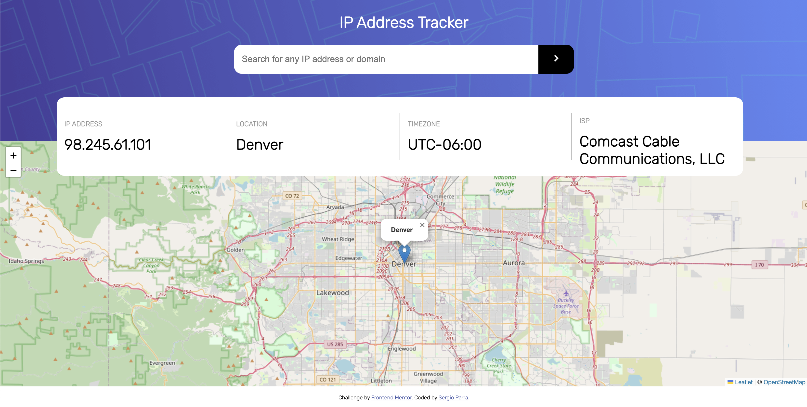

# Frontend Mentor - IP address tracker solution

This is a solution to the [IP address tracker challenge on Frontend Mentor](https://www.frontendmentor.io/challenges/ip-address-tracker-I8-0yYAH0).

## Table of contents

- [Overview](#overview)
  - [The challenge](#the-challenge)
  - [Screenshot](#screenshot)
  - [Links](#links)
- [My process](#my-process)
  - [Built with](#built-with)
  - [What I learned](#what-i-learned)
  - [Useful resources](#useful-resources)
- [Author](#author)

## Overview

### The challenge

Users should be able to:

- View the optimal layout for each page depending on their device's screen size
- See hover states for all interactive elements on the page
- See their own IP address on the map on the initial page load
- Search for any IP addresses or domains and see the key information and location

### Screenshot



### Links

- Live Site URL: [https://sergioparral.github.io/ip-address-tracker-master]

## My process

### Built with

- Semantic HTML5 markup
- CSS custom properties
- Flexbox
- CSS Grid
- Mobile-first workflow

**Note: These are just examples. Delete this note and replace the list above with your own choices**

### What I learned

This is a project for practice the css grid and media query. In general for practice the responsive and adaptive layout in differents screens.

```css
  @media (min-width: 690px) {
    .header-section .header-title {
      font-size: 2rem;
    }
  }

  @media (min-width:950px){
    .header-section .header-form{
        width: 55%;
    }
    .content-section{
        grid-template-columns: repeat(4,25%);
        align-items: center;
        text-align: left;
        height: 8rem;
    }
  }
```

  In other way I used the sessionStorage for saved the ip's data

```javaScript
  if(!sessionStorage.ip == ''){
    fetchData(`${$key}${$getSessionStorage}`)
      .then(response => response.json())
      .then(resp => {
              dataConstruction(resp)
          })
      .catch(err => console.error())
  }
```

### Useful resources
- [API for geolocation](https://geo.ipify.org) - This API is very easy to use, because give the data precise and order.
- [API for create maps.](https://leafletjs.com) - A little trick for use, but very well in the moment to show the data, simple and easy. Have a lot setting for different use case.

## Author

- Website - [Sergio Parra](https://sergioparral.github.io/PortFolio/)
- LinkedIn -[Sergio Parra](https://www.linkedin.com/in/sergioparral/)
- Twitter - [@Parranopolis00](https://twitter.com/Parranopolis00)
